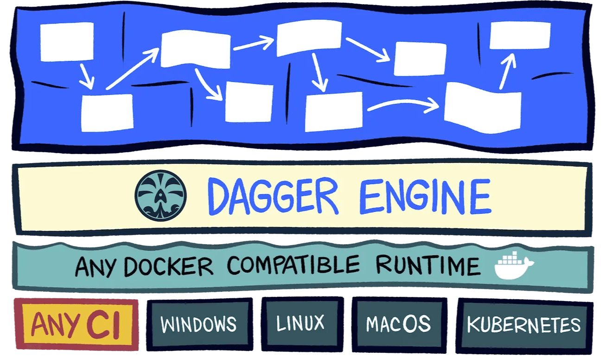
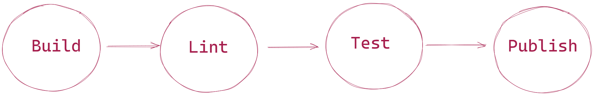
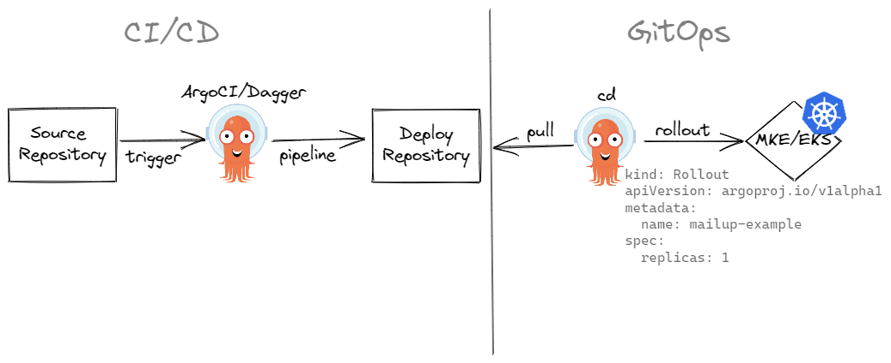

# ZeroTurnaround CI/CD with Dagger

This guide walks you through the process of managing a CI/CD pipeline with Dagger for a "Calculator" CLI.

## Why Dagger?

Knowing where to get started with continuous delivery (CD) can be hard, especially when you’re starting from having no automation at all, when you’re making something brand-new, or when you have a pile of legacy code already built up.

Automation is the key to writing Better Software Faster, and is the engine that drives an effective Deployment Pipeline.  
Through Automation we can speed up our software development activities, carry out multiple processes in parallel, and reduce the risks of human error.  
Manual processes are costly and not easily repeatable. Manual testing is often repetitive, low quality and not a good use of a human being’s creative skills (with the exception of exploratory testing).
We aim to automate any and all repeatable processes that don’t require human ingenuity.  
We automate everything we can in the Deployment Pipeline so that our development activities are
repeatable, reliable and carried out efficiently, and with consistent results.  

And that’s where Dagger comes in.  

## What is Dagger?

Dagger is a programmable CI/CD engine that runs your pipelines in containers.  
It permits to write your pipelines as code, in the same programming language (SDK) as your application and
executes your pipelines entirely as standard OCI containers on buildkit.  
Dagger has several benefits:

- Testable: you can try pipelines locally.
- Portable: the same pipeline can run on your local machine, a CI runner, a dedicated server, or any container hosting service.
- Extensible: frequent tasks can be organized using libraries.
- Poliglot: pipeline can be written in different languages.



## Calculator CLI

We are going to build a Calculator application with basic operation of "addition", "subtraction", "multiplication", "division", "power".  
We will build the code and generate container images that will run on all platforms.  

Refer to examples below you will get some idea.  

```shell
calc sum 2 5 # 7
calc sub 5 2 # 3
calc mul 2 3 # 6
calc div 6 2 # 3
calc pow 2 3 # 8
```

## Let's start with TDD

Test-driven development follows a three-phase process:

- <span style="color:red">Red</span>. We write a failing test (including possible compilation failures). We run the test suite to verify the failing tests.

- <span style="color:green">Green</span>. We write just enough production code to make the test green. We run the test suite to verify this.

- <span style="color:blue">Refactor</span>. We remove any code smells. These may be due to duplication, hardcoded values, or improper use of language idioms (e.g., using a verbose loop instead of a built-in iterator). If we break any tests during refactoring, we prioritize getting them back to green before exiting this phase.

Application must verify the following tests

```go
func TestSum(t *testing.T) {
 type testCase struct {
  first  int
  second int
  sum    int
 }

 cases := []testCase{
  // cases goes here
 }

 for _, tc := range cases {
  sum := Sum(tc.first, tc.second)

  assert.Equal(t, sum, tc.sum)
 }
}

func TestSub(t *testing.T) {
 type testCase struct {
  first  int
  second int
  sub    int
 }

 cases := []testCase{
  // cases goes here
 }

 for _, tc := range cases {
  sub := Sub(tc.first, tc.second)

  assert.Equal(t, sub, tc.sub)
 }
}

func TestMul(t *testing.T) {
 type testCase struct {
  first  int
  second int
  mul    int
 }

 cases := []testCase{
  // cases goes here
 }

 for _, tc := range cases {
  mul := Mul(tc.first, tc.second)

  assert.Equal(t, mul, tc.mul)
 }
}

func TestDiv(t *testing.T) {
 type testCase struct {
  first  int
  second int
  div    int
  ok     bool
 }

 cases := []testCase{
  // cases goes here
 }

 for _, tc := range cases {
  div, err := Div(tc.first, tc.second)

  if !tc.ok && err == nil {
   t.Error("expected div error")
  }

  if tc.ok && err != nil {
   t.Error(err)
  }

  if tc.ok && err == nil {
   assert.Equal(t, div, tc.div)
  }
 }
}

func TestPow(t *testing.T) {
 type testCase struct {
  base     int
  exponend int
  power    int
 }

 cases := []testCase{
  // cases goes here
 }

 for _, tc := range cases {
  power := Pow(tc.base, tc.exponend)

  assert.Equal(t, power, tc.power)
 }
}
```

You can find the entire code in this [repository](https://github.com/Alvise88/zero-turnaround-CI/CD-with-dagger)

## Defining CI/CD pipeline

We are going to implement a simple pipeline within Dagger GO SDK

.

The initial structure looks like

```go
type Calc mg.Namespace

func (calc Calc) Build(ctx context.Context) error {
 return errors.New("build: not implemented")
}

func (calc Calc) Lint(ctx context.Context) error {
 return errors.New("lint: not implemented")
}

func (calc Calc) Test(ctx context.Context) error {
 return errors.New("test: not implemented")
}

func (calc Calc) Publish(ctx context.Context) error {
 return errors.New("publish: not implemented")
}
```

Now that the basic structure of the Go CI tool is defined and functional, the next step is to flesh out its ```Build()``` function

```go
func (calc Calc) Build(ctx context.Context) error {

 fmt.Println("Building with Dagger")

 // initialize Dagger client
 client, err := dagger.Connect(ctx, dagger.WithLogOutput(os.Stdout))
 if err != nil {
  return err
 }
 defer client.Close()

 // get reference to the local project
 src := client.Host().Directory(".")

 // get `golang` image
 golang := client.Container().From(fmt.Sprintf("golang:%s-alpine", goVersion))

 // mount cloned repository into `golang` image
 golang = golang.WithMountedDirectory("/src", src).WithWorkdir("/src")

 // define the application build command
 path := "out"

 // CGO_ENABLED=0 go build -o /out/calc -ldflags '-s -d -w' ./cmd/calc
 golang = golang.WithExec([]string{
  "go",
  "build",
  "-o",
  fmt.Sprintf("%s/calc", path),
  "./cmd/calc",
 })

 // get reference to build output directory in container
 output := golang.Directory(path)

 // write contents of container build/ directory to the host
 _, err = output.Export(ctx, path)
 if err != nil {
  return err
 }

 return nil
}
```

The revised Build() function is the main workhorse here, so let's step through it in detail.

- It begins by creating a Dagger client with dagger.Connect().
- It uses the client's Host().Directory() method to obtain a reference to the current directory on the host. This reference is stored in the src variable.
- It initializes a new container from a base image with the Container().From() method and returns a new Container struct. In this case, the base image is the golang alpine image.
- It mounts the filesystem of the repository branch in the container using the WithMountedDirectory() method of the Container.
- It uses the WithExec() method to define the command to be executed in the container - in this case, the command go build -o PATH, where PATH refers to the out/ directory in the container. The WithExec() method returns a revised Container containing the results of command execution.
- It obtains a reference to the out/ directory in the container with the Directory() method.
- It writes the out/ directory from the container to the host using the Directory.Export() method.

The next step is to extend it for multiple OS and architecture combinations.

```go
func (calc Calc) Build(ctx context.Context) error {
 fmt.Println("Building with Dagger")

 // define build matrix
 oses := []string{"linux", "darwin"}
 arches := []string{"amd64", "arm64"}

 // initialize Dagger client
 client, err := dagger.Connect(ctx, dagger.WithLogOutput(os.Stdout))
 if err != nil {
  return err
 }
 defer client.Close()

 // get reference to the local project
 src := client.Host().Directory(".")

 // create empty directory to put build outputs
 outputs := client.Directory()

 // get `golang` image
 golang := client.Container().From(fmt.Sprintf("golang:%s-alpine", goVersion))

 // mount cloned repository into `golang` image
 golang = golang.WithMountedDirectory("/src", src).WithWorkdir("/src")

 for _, goos := range oses {
  for _, goarch := range arches {
   // create a directory for each os and arch
   path := fmt.Sprintf("out/%s/%s/", goos, goarch)

   // set GOARCH and GOOS in the build environment
   build := golang.WithEnvVariable("GOOS", goos)
   build = build.WithEnvVariable("GOARCH", goarch)

   // build application
   build = build.WithExec([]string{"go", "build", "-o", path, "./cmd/calc"})

   // get reference to build output directory in container
   outputs = outputs.WithDirectory(path, build.Directory(path))
  }
 }

 // write build artifacts to host
 _, err = outputs.Export(ctx, ".")
 if err != nil {
  return err
 }

 return nil
}
```

Dockerfile is not used to build calc image; the next pipeline phase is linting

```go
func (calc Calc) Lint(ctx context.Context) error {
 fmt.Println("Linting with Dagger")

 client, err := dagger.Connect(ctx, dagger.WithLogOutput(os.Stderr))
 if err != nil {
  return err
 }
 defer client.Close()

 // get reference to the local project
 src := client.Host().Directory(".")

 _, err = client.Container().
  From("golangci/golangci-lint:v1.48").
  WithMountedDirectory("/app", src).
  WithWorkdir("/app").
  WithExec([]string{"golangci-lint", "run", "-v", "--timeout", "5m"}, dagger.ContainerWithExecOpts{}).
  ExitCode(ctx)

 return err
}
```

 Similarly for testing task

```go
 func (calc Calc) Test(ctx context.Context) error {
 fmt.Println("Testing with Dagger")

 client, err := dagger.Connect(ctx, dagger.WithLogOutput(os.Stderr))
 if err != nil {
  return err
 }
 defer client.Close()

 // get reference to the local project
 src := client.Host().Directory(".")

 // get `golang` image
 golang := client.Container().From(fmt.Sprintf("golang:%s-alpine", goVersion))

 // mount cloned repository into `golang` image
 golang = golang.WithMountedDirectory("/src", src).WithWorkdir("/src")

 _, err = golang.
  WithEnvVariable("CGO_ENABLED", "0").
  WithExec([]string{"go", "test", "./..."}, dagger.ContainerWithExecOpts{}).
  ExitCode(ctx)

 return err
}
```

The latest step consists on publishing a multiplatform image and this completes the continuos delivery pipeline

```go
func (calc Calc) Publish(ctx context.Context) error {
 fmt.Println("Publishing with Dagger")

 client, err := dagger.Connect(ctx, dagger.WithLogOutput(os.Stderr))
 if err != nil {
  return err
 }
 defer client.Close()

 imageRepo := "alvisevitturi/calc:latest"

 // get reference to the local project
 src := client.Host().Directory(".")

 // get `golang` image
 golang := client.Container().From(fmt.Sprintf("golang:%s-alpine", goVersion))

 // mount cloned repository into `golang` image
 golang = golang.WithMountedDirectory("/src", src).WithWorkdir("/src")

 platformVariants := make([]*dagger.Container, 0, len(platforms()))

 for _, goos := range oses {
  for _, goarch := range arches {
   platform := dagger.Platform(fmt.Sprintf("%s/%s", goos, goarch))

   // set GOARCH and GOOS in the build environment
   build := golang.WithEnvVariable("GOOS", goos)
   build = build.WithEnvVariable("GOARCH", goarch)

   // build application (crosscompilation)
   build = build.WithExec([]string{"go", "build", "-o", "/output/calc", "./cmd/calc"})

   // select the output directory
   outputDir := build.Directory("/output")

   // wrap the output directory in a new empty container marked
   // with the platform
   calc := client.
    Container(dagger.ContainerOpts{Platform: platform}).
    WithRootfs(outputDir)
   platformVariants = append(platformVariants, calc)
  }
 }

 // publishing the final image uses the same API as single-platform
 // images, but now additionally specify the `PlatformVariants`
 // option with the containers built before.
 imageDigest, err := client.
  Container().
  Publish(ctx, imageRepo, dagger.ContainerPublishOpts{
   PlatformVariants: platformVariants,
  })
 if err != nil {
  panic(err)
 }
 fmt.Println("published multi-platform image with digest", imageDigest)

 return nil
}
```

We can run pipeline tasks in this way

```go
mage calc:build
mage calc:lint
mage calc:test
mage calc:publish
```

## Create Abstraction

```go
type Go struct {
  Version string
  Packages []string
}

func Go(spec Go) *dagger.Container{
  // code goes here
}
```

## Integrate with your CI environment

Once you have Dagger running locally, it's easy to use Dagger with any CI environment (no migration required) to run the same Dagger pipelines. Any CI environment with Docker pre-installed works with Dagger out of the box.

For GitHub Action we can use this manifest

```yaml
name: calc

on:
  push:
    branches:
      - main

jobs:
  build:
    runs-on: ubuntu-latest
    steps:
      - uses: actions/checkout@v3
      - uses: docker/login-action@v2
        name: Login to Docker Hub
        with:
          username: ${{ secrets.DOCKERHUB_USERNAME }}
          password: ${{ secrets.DOCKERHUB_TOKEN }}
      - uses: actions/setup-go@v3
        with:
          go-version: 1.19
      - uses: magefile/mage-action@v2
        with:
          version: v1.14.0
          args: calc:build
  lint:
    needs: [build]
    runs-on: ubuntu-latest
    steps:
      - uses: actions/checkout@v3
      - uses: docker/login-action@v2
        name: Login to Docker Hub
        with:
          username: ${{ secrets.DOCKERHUB_USERNAME }}
          password: ${{ secrets.DOCKERHUB_TOKEN }}
      - uses: actions/setup-go@v3
        with:
          go-version: 1.19
      - uses: magefile/mage-action@v2
        with:
          version: v1.14.0
          args: calc:lint
  test:
    needs: [build]
    runs-on: ubuntu-latest
    steps:
      - uses: actions/checkout@v3
      - uses: docker/login-action@v2
        name: Login to Docker Hub
        with:
          username: ${{ secrets.DOCKERHUB_USERNAME }}
          password: ${{ secrets.DOCKERHUB_TOKEN }}
      - uses: actions/setup-go@v3
        with:
          go-version: 1.19
      - uses: magefile/mage-action@v2
        with:
          version: v1.14.0
          args: calc:test
  publish:
    needs: [lint, test]
    runs-on: ubuntu-latest
    steps:
      - uses: actions/checkout@v3
      - uses: docker/login-action@v2
        name: Login to Docker Hub
        with:
          username: ${{ secrets.DOCKERHUB_USERNAME }}
          password: ${{ secrets.DOCKERHUB_TOKEN }}
      - uses: actions/setup-go@v3
        with:
          go-version: 1.19
      - uses: magefile/mage-action@v2
        with:
          version: v1.14.0
          args: calc:publish 
```

We have built an internal CI/CD platform inpired by GitHub Action, focused on Dagger called ArgoCI, it uses ArgoWorflow and it runs on Kubernetes

For MailUp ArgoCI platform we can use this manifest

```yaml
name: "calc"

on: ["push", "pull_request"]
env:
  DO_NOT_TRACK: true
jobs:
  build:
    runs-on: go
    steps:
      - name: cli
        with:
          action: "calc:build"
          registry-creds: regcred
  lint:
    needs: [build]
    runs-on: go
    steps:
      - name: cli
        with:
          action: "calc:lint"
          registry-creds: regcred
  test:
    needs: [build]
    runs-on: go
    steps:
      - name: cli
        with:
          action: "calc:test"
          registry-creds: regcred
  publish:
    needs: [lint, test]
    runs-on: go
    steps:
      - name: cli
        with:
          action: "calc:publish"
          registry-creds: regcred
```

This manifest will be converted in something similar to

```yaml
---
# Generated by argoci; do not edit
apiVersion: argoproj.io/v1alpha1
kind: Workflow
metadata:
  generateName: calc-
  labels:
    CI/CD.mailup.com/based-on: dagger
    CI/CD.mailup.com/description: ""
    CI/CD.mailup.com/project: calc
    CI/CD.mailup.com/team: teamname
    CI/CD.mailup.com/managed-by: argoci
  namespace: CI/CD
spec:
  entrypoint: ci
  templates:
  - dag:
      tasks:
        name: checkout
        templateRef:
          name: git-checkout-v1
          template: git-checkout
      - arguments:
          parameters:
          - name: env
            value: DO_NOT_TRACK=true
          - name: path
            value: calc
          - name: action
            value: calc:build
          - name: registry-creds
            value: regcred
        dependencies:
        - checkout
        name: build-build
        templateRef:
          name: dagger-v1
          template: go-sdk
      - arguments:
          parameters:
          - name: env
            value: DO_NOT_TRACK=true
          - name: path
            value: calc
          - name: action
            value: calc:lint
          - name: registry-creds
            value: regcred
        dependencies:
        - build-build
        name: lint-lint
        templateRef:
          name: dagger-v1
          template: go-sdk
      - arguments:
          parameters:
          - name: env
            value: DO_NOT_TRACK=true
          - name: path
            value: calc
          - name: action
            value: calc:test
          - name: registry-creds
            value: regcred
        dependencies:
        - build-build
        name: test-test
        templateRef:
          name: dagger-v1
          template: go-sdk
      - arguments:
          parameters:
          - name: env
            value: DO_NOT_TRACK=true
          - name: path
            value: calc
          - name: action
            value: calc:publish
          - name: registry-creds
            value: regcred
        dependencies:
        - lint-lint
        - test-test
        name: publish-publish
        templateRef:
          name: dagger-v1
          template: go-sdk
```

## Final CI/CD Architecure

.
